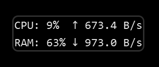

# TransparentSystemMonitor (TSM)

Windows 实时硬件监控系统 - 透明悬浮窗设计

## 📊 功能特性

### 实时监控
- **CPU 利用率** - 每秒更新，显示所有逻辑核心平均负载
- **RAM 利用率** - 物理内存使用百分比
- **网络上传速率** - 自动识别物理网卡，智能单位转换
- **网络下载速率** - 差值计算，精确到字节

### 📸 效果预览



*透明悬浮窗效果 - 可放置在桌面任意位置，完美融入背景*

### 视觉设计
- **透明背景** - 完美融入任务栏或桌面任意位置
- **可拖动定位** - 托盘菜单或双击切换鼠标穿透模式，轻松放置到任何位置
- **动态颜色反馈** - 
  - 正常 (<90%): 白色半透明
  - 警告 (90%-95%): 橙色
  - 危险 (>95%): 红色
- **DPI 自适应** - 高分屏下清晰显示
- **两列布局** - CPU/RAM 和网速分列显示，紧凑美观

### 交互功能
- **系统托盘图标** - 左键点击打开 Dashboard
- **右键菜单** - 快速设置
  - 📊 Dashboard（查看 1 分钟趋势图）
  - 🎨 文字颜色（自动/白色/黑色）
  - ⚡ 刷新频率（0.5s/1s/3s）
  - 🚀 开机自启
  - ❌ 退出程序

### 技术亮点
- **智能网卡识别** - 自动选择物理网卡，跳过虚拟网卡（VMware、Hyper-V 等）
- **鼠标穿透开关** - 托盘菜单一键切换，双击窗口也可切换
- **网卡手动选择** - 支持用户指定监控特定网卡
- **低资源占用** - 内存 <40MB，CPU 占用极低
- **多线程采集** - 独立线程运行数据采集，UI 流畅不卡顿
- **灵活定位** - 可放置在屏幕任意位置，不仅限于任务栏

## 系统要求

- **操作系统**: Windows 11
- **Python**: 3.8+
- **依赖库**: 见 `requirements.txt`

## 🚀 快速开始

### 方法一：使用虚拟环境运行（推荐）

1. **创建虚拟环境**
   ```powershell
   cd TaskbarSystemMonitor
   python -m venv venv
   ```

2. **激活虚拟环境**
   ```powershell
   .\venv\Scripts\Activate.ps1
   ```

3. **安装依赖**
   ```powershell
   pip install -r requirements.txt
   ```

4. **运行程序**
   ```powershell
   python main.py
   ```

### 方法二：打包为可执行文件

1. **安装 PyInstaller**
   ```powershell
   pip install pyinstaller
   ```

2. **打包程序**
   ```powershell
   pyinstaller --name="TaskbarSystemMonitor" ^
               --windowed ^
               --onefile ^
               --hidden-import=psutil ^
               --hidden-import=PySide6 ^
               --hidden-import=matplotlib ^
               main.py
   ```

3. **运行打包后的程序**
   ```powershell
   .\dist\TaskbarSystemMonitor.exe
   ```

## 📖 使用说明

### 首次运行

1. 程序启动后，窗口会出现在屏幕中央
2. **方法一：托盘菜单控制（推荐）**
   - 右键点击系统托盘图标
   - 选择 "🖱️ 鼠标穿透模式：关闭"
   - 拖动窗口到理想位置（任务栏、桌面边缘等）
   - 再次右键托盘 → 选择 "开启" 穿透模式
3. **方法二：双击窗口**
   - 双击窗口出现绿色边框（关闭穿透）
   - 拖动窗口到理想位置
   - 再次双击开启穿透模式

### 查看详细信息

- **左键点击托盘图标** - 打开 Dashboard，查看过去 1 分钟的 CPU/RAM 趋势图

### 自定义设置

**右键点击托盘图标**，可以：

1. **📊 Dashboard** - 打开 1 分钟趋势图

2. **🖱️ 鼠标穿透模式** - 切换窗口的鼠标穿透状态
   - **开启**: 窗口透明，鼠标穿过，无法拖动
   - **关闭**: 绿色边框提示，可以拖动窗口

3. **🌐 监控网卡** - 选择要监控的网络适配器
   - **自动选择（推荐）**: 智能识别物理网卡
   - **WLAN**: WiFi 网卡
   - **以太网**: 有线网卡
   - 其他物理网卡（自动过滤虚拟网卡）

4. **🎨 文字颜色**
   - **自动**: 根据使用率动态变化（推荐）
   - **白色**: 固定白色（适合深色任务栏）
   - **黑色**: 固定黑色（适合浅色任务栏）

5. **⚡ 刷新频率**
   - **0.5 秒**: 数据更新最快，略微增加 CPU 占用
   - **1 秒**: 默认值，平衡性能和流畅度（推荐）
   - **3 秒**: 最低资源占用

6. **🚀 开机自启**
   - 勾选后程序将随 Windows 启动
   - 自动写入注册表 `HKEY_CURRENT_USER\Software\Microsoft\Windows\CurrentVersion\Run`

7. **❌ 退出** - 关闭程序

### 退出程序

1. 右键托盘图标 → 退出
2. 或在运行终端按 Ctrl+C

## 项目结构

```
TransparentSystemMonitor/
├── main.py                 # 程序入口
├── data_engine.py          # 数据采集模块
├── window_positioning.py   # 窗口定位模块（可拖动透明窗口）
├── main_window.py          # 主界面模块（可拖动透明窗口）
├── system_tray.py          # 托盘管理模块
├── dashboard.py            # Dashboard 弹窗
├── settings_manager.py     # 配置管理模块
├── utils.py                # 工具函数
├── requirements.txt        # Python 依赖
├── README.md               # 项目说明
└── OPEN_SOURCE_NOTICE.md   # 开源许可证声明
```

## 技术实现

### 核心 API

- **数据采集**: `psutil` - CPU、内存、网络信息
- **UI 框架**: `PySide6` - Qt for Python
- **图表绘制**: `matplotlib` - Dashboard 折线图
- **Windows API**: `ctypes` - 窗口样式设置

### 关键特性

#### 1. 智能网卡识别
自动检测并使用物理网卡（WiFi/以太网），跳过虚拟网卡：
- VMware (VMnet1, VMnet8)
- Hyper-V
- Docker
- WSL
- 回环接口

#### 2. 鼠标穿透开关
**两种切换方式：**
- **托盘菜单**: 右键托盘 → 鼠标穿透模式（推荐）
- **双击窗口**: 双击窗口切换（备用）

**穿透模式状态：**
- **开启**: 完全透明，鼠标穿过，无法拖动
- **关闭**: 绿色边框提示，可以拖动定位

#### 3. 网卡手动选择
- **默认行为**: 自动选择活跃物理网卡
- **用户指定**: 支持从托盘菜单选择特定网卡
- **优先级**: 用户指定 > 自动检测

#### 4. 性能优化
- **多线程采集**: 独立 QThread 运行数据采集
- **异步更新**: 信号槽机制更新 UI
- **差值计算**: 网络流量采用时间差值法
- **智能休眠**: 根据刷新率动态调整采集频率

## 💡 常见问题

### Q: 窗口位置不对？
A: 右键托盘 → 关闭穿透模式，拖动到理想位置，再次右键托盘 → 开启穿透模式。或者双击窗口切换。

### Q: 窗口处于穿透状态无法拖动怎么办？
A: 右键点击系统托盘图标 → 选择“鼠标穿透模式：关闭”，即可拖动窗口。这是推荐的方式！

### Q: 文字看不清？
A: 右键托盘图标 → 文字颜色 → 选择与任务栏对比度高的颜色。

### Q: 网络速度显示 0？
A: 程序会自动识别物理网卡。如果没有网络活动，会显示 0 B/s。尝试下载文件看看是否有变化。也可以右键托盘 → 监控网卡 → 手动选择正确的网卡。

### Q: 开机自启无效？
A: 检查杀毒软件是否阻止了注册表写入。可以手动将快捷方式放入启动文件夹。

### Q: Dashboard 图表为空？
A: 需要等待至少 1 秒钟采集数据后再打开 Dashboard。

### Q: 如何精确控制窗口位置？
A: 建议关闭穿透模式后（右键托盘），慢慢拖动到精确位置，然后再开启穿透模式。

### Q: 有多个网卡如何选择？
A: 右键托盘 → 监控网卡 → 选择要监控的网卡（如 WLAN 或 以太网）。默认自动选择最活跃的的物理网卡。

## 🛠️ 开发说明

### 添加新的监控项

1. 在 `data_engine.py` 的 `_collect_data()` 中添加数据采集逻辑
2. 在 `main_window.py` 的 `setup_ui()` 中添加对应的 QLabel
3. 在 `update_data()` 中更新显示内容

### 修改颜色阈值

编辑 `utils.py` 中的 `calculate_color_from_percentage()` 函数：

```python
def calculate_color_from_percentage(percentage):
    if percentage >= 95:  # 可修改阈值
        return "#FF0000"
    elif percentage >= 90:  # 可修改阈值
        return "#FFA500"
    else:
        return "rgba(255, 255, 255, 0.9)"
```

### 使用场景

#### 场景 1：任务栏监控
将透明窗口放置在任务栏上，完美融入系统界面

#### 场景 2：桌面悬浮窗
将窗口固定在桌面边缘，作为独立的监控面板

#### 场景 3：多显示器
在不同显示器上各放置一个窗口（需要运行多个实例）

## 📝 许可证

本项目采用 **MIT License** 开源许可证。

详见 [LICENSE](LICENSE) 和 [OPEN_SOURCE_NOTICE.md](OPEN_SOURCE_NOTICE.md) 文件。

## 🤝 贡献

欢迎提交 Issue 和 Pull Request！

## 📋 更新日志

### v1.0.0 (2026-03-24)
- ✨ 实时监控 CPU、RAM、网络流量
- ✨ 可拖动透明窗口设计，双击切换鼠标穿透模式
- ✨ 托盘菜单控制：穿透开关、网卡选择、Dashboard
- ✨ 智能物理网卡识别，自动跳过虚拟网卡（VMware、Hyper-V 等）
- ✨ 网卡手动选择功能，支持指定监控特定网卡
- ✨ 动态颜色反馈（正常/警告/危险）
- ✨ Dashboard 查看 1 分钟趋势图
- ✨ 系统托盘右键菜单完整功能
- ✨ 开机自启、刷新率调整、文字颜色设置
- ✨ DPI 自适应，高分屏清晰显示
- ✨ 两列并排布局，紧凑美观
- ✨ 低资源占用：内存 <40MB，CPU <1%

---

**Enjoy Monitoring! 🚀**
